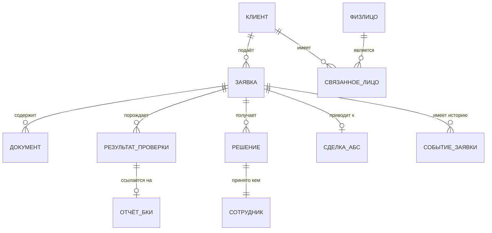

# От концептуальной модели к логической

Модель данных — это зафиксированный ответ на вопрос «о чём вообще система».
Ошибка в ней стоит дороже любой другой: интерфейс переделывают за спринт,
интеграцию — за две недели, а неверно выбранную сущность вырезают месяцами,
потому что к тому времени на неё ссылается всё.

## Три уровня и что на каждом решается

| Уровень | Что содержит | Кто согласует |
| --- | --- | --- |
| Концептуальный | Сущности предметной области и связи между ними, без атрибутов и ключей | Заказчик, эксперты предметной области |
| Логический | Атрибуты, типы, ключи, кардинальность, обязательность, ограничения целостности | Аналитик и архитектор |
| Физический | Таблицы, индексы, партиционирование, типы конкретной СУБД | Разработчик и администратор БД |

Аналитик отвечает за первые два. Смешение уровней — самая частая беда
обсуждений: разговор о том, является ли поручительство отдельной сущностью,
сваливается в спор об индексах, и предметный вопрос остаётся нерешённым.

## Как отличить сущность от атрибута

Три проверки, в порядке применения:

1. **Самостоятельный жизненный цикл.** У объекта есть собственные состояния и
   события, не сводимые к состояниям владельца. Документ подписывают, отзывают,
   заменяют — это сущность. Комментарий к заявке живёт и умирает вместе с
   заявкой — это атрибут или подчинённая запись.
2. **Множественность.** Если значений может быть больше одного и это нормально,
   перед вами сущность. Телефон клиента почти всегда множественный.
3. **Собственные атрибуты у связи.** Если связь «многие ко многим» нуждается в
   дате, роли или доле, она сама является сущностью. Связь «клиент — учредитель»
   требует доли владения и даты — значит, это отдельная сущность.

## Ключи, типы, даты и деньги

| Решение | Правило | Почему |
| --- | --- | --- |
| Первичный ключ | Суррогатный, UUID или последовательность | Бизнес-идентификаторы исправляют: ИНН вводят с ошибкой, номер договора перевыпускают |
| Бизнес-ключ | Хранится отдельным полем с ограничением уникальности там, где уместно | Нужен для сопоставления с внешними системами |
| Деньги | Целое в минорных единицах или `numeric(18,2)` | Двоичная плавающая точка даёт расхождения в копейках, которые видит бухгалтерия |
| Момент времени | `timestamptz`, хранение в UTC | 38 отделений в разных часовых поясах; «вчера в 18:00» без зоны неоднозначно |
| Дата без времени | `date` | Дата подписания договора не имеет часового пояса |
| Перечисления | Отдельный справочник или явно зафиксированный список значений | Значения статусов попадают в отчётность и интеграции, их нельзя менять молча |

Отдельно про обязательность: `NOT NULL` на уровне логической модели — это
бизнес-утверждение «без этого объект не существует». Поле, обязательное только в
одном состоянии, не может быть обязательным в модели: обязательность в таком
случае проверяется на переходе.

## Где ошибаются

- **Внешний идентификатор как первичный ключ.** `customer_id` из АБС в роли
  первичного ключа означает, что при смене системы или при слиянии дублей
  придётся переписывать все ссылки.
- **Одна таблица «на всё».** Заявка, где 80 полей заполняются в зависимости от
  типа продукта, читается только автором и обрастает правилами вида «если поле A,
  то поле B обязательно», которые невозможно протестировать.
- **Отсутствие связи между решением и данными, на которых оно принято.** Через
  год данные изменятся, и объяснить решение будет нечем.
- **Хранение вычисляемого без причины.** Дублирование суммы платежа в трёх
  местах гарантирует расхождение; исключение — значения, имеющие юридическую
  силу на момент фиксации.

## На конвейере

Четыре решения этой модели с обоснованием.

**Решение — отдельная сущность, а не статус заявки.** По заявке свыше 20 млн ₽
решений минимум три: первый андеррайтер, второй андеррайтер, кредитный комитет.
Каждое имеет автора, время, версию правил и обоснование. Сложи их в поля
заявки — и модель сломается на первом же комитете, который отправил заявку на
пересмотр.

**Связанное лицо — сущность, а не атрибут клиента.** У руководителя и учредителя
есть доля владения, дата возникновения полномочий и признак проверки СБ. Кроме
того, одно и то же физлицо может быть связано с несколькими клиентами — и это
важнейший признак для риск-анализа: группа связанных заёмщиков.

**Результат проверки отделён от отчёта БКИ.** Результат («стоп-факторов нет»,
«балл 640») хранится долго и участвует в отчётности. Сам отчёт бюро —
чувствительные данные с собственным сроком хранения, и он должен удаляться
независимо от заявки.

**Сделка в АБС — ссылка, а не копия.** «Конвейер» хранит `deal_id` и дату
передачи. Сумма фактической задолженности, график платежей, просрочки — всё это
живёт в АБС, где источник истины, и запрашивается по требованию.

Фрагмент логической модели заявки:

| Поле | Тип | Обязательность | Примечание |
| --- | --- | --- | --- |
| `application_id` | uuid | да | Первичный ключ, генерируется «Конвейером» |
| `number` | text | да | Человекочитаемый номер вида `MSB-2026-004312`, уникален |
| `customer_id` | uuid | нет | Ссылка на клиента; null, пока клиент не заведён в АБС |
| `inn` | char(10) или char(12) | да | Бизнес-ключ; 10 знаков у юрлица, 12 у ИП |
| `amount_minor` | bigint | да | Сумма в копейках; ограничение 50 000 000 000–5 000 000 000 000 |
| `term_months` | smallint | да | Ограничение 6–60 |
| `status` | text | да | Значения из модели состояний, список зафиксирован |
| `rules_version` | int | да | Заполняется при переходе в `submitted` |
| `branch_code` | text | да | Отделение-владелец; основа изоляции доступа |
| `created_by` | uuid | да | Сотрудник-автор; используется правилом четырёх глаз |
| `submitted_at` | timestamptz | нет | Момент отправки на проверку |

Поле `branch_code` попало в модель не из требований к функциональности, а из
требования к доступу: менеджер видит заявки только своего отделения. Атрибут,
существующий ради разграничения доступа, — нормальная и частая ситуация во
внутренних системах, и лучше осознать это на этапе модели, чем прикручивать
фильтр к каждому запросу потом.
