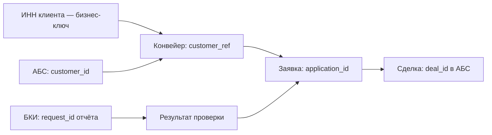

# Классификация данных и мастер-данные

В корпоративной системе у каждого поля есть два паспорта: кто им владеет и
насколько оно чувствительно. Первый определяет, где его можно менять; второй —
где его можно показывать, хранить и логировать. Модель данных без этих двух
измерений выглядит полной, но по ней нельзя ни спроектировать доступ, ни
ответить на вопрос ИБ.

## Классификация по чувствительности

Классы задаёт банк, но конструкция почти всегда такая:

| Класс | Примеры полей | Следствия для проектирования |
| --- | --- | --- |
| Открытые | ОГРН, наименование юрлица, данные из ЕГРЮЛ | Ограничений нет |
| Внутренние | Статус заявки, очередь, срок рассмотрения | Не выходят за периметр, доступ по роли |
| Персональные данные | ФИО, телефон, паспорт, СНИЛС руководителя | Минимизация состава, маскирование, журнал доступа, срок хранения, основание обработки |
| Банковская тайна | Обороты по счетам, задолженность, отчёт БКИ | Доступ по служебной необходимости, обязательное журналирование, запрет в логах и выгрузках |
| Секреты | Токены интеграций, ключи подписи | Не хранятся в системе, только в хранилище секретов |

Классификация — не документ для ИБ, а вход для семи проектных решений: состав
полей API, содержимое логов, правила маскирования в интерфейсе, состав выгрузок,
срок хранения, необходимость журналирования доступа и требования к тестовым
данным. Отсюда практическое следствие: класс проставляется в той же таблице, где
описаны поля, а не в отдельном файле.

Важная деталь: класс определяется не только полем, но и его сочетанием.
Обезличенная сумма кредита — внутренние данные; та же сумма рядом с ИНН — уже
сведения о клиенте. Поэтому классифицируют не столбцы, а наборы, которые
покидают систему: экран, ответ API, выгрузка, событие.

## Мастер-данные: один источник истины

Для каждой сущности, живущей больше чем в одной системе, фиксируется таблица
владения: кто создаёт, кто изменяет, кто только читает, как узнаёт об изменении.

Правило, экономящее месяцы: система, которая не владеет данными, не редактирует
их у себя. Если пользователю нужно исправить чужие данные, он делает это в
системе-владельце, а не в вашей копии. Иначе появляется «второе мнение» об
адресе клиента, и сверки его не устранят.

Кеш чужих данных допустим, но требует четырёх ответов: срок жизни, способ
инвалидации, поведение при устаревании, допустимость показа устаревших данных
пользователю. Для персональных данных добавляется пятый: срок хранения кеша не
может превышать срок, на который получено согласие.

## Сопоставление идентификаторов

У одного клиента в корпоративной среде обычно три идентификатора: бизнес-ключ
(ИНН), идентификатор в системе-владельце и локальный. Держите их разделёнными и
не используйте чужой идентификатор как свой первичный ключ.

Отдельно решается вопрос, что делать с дублями: два обращения одного клиента,
заведённые как разные записи. Слияние — операция системы-владельца, а ваша
система должна пережить его без потерь: хранить ссылку и уметь обработать
событие «идентификатор A заменён на B».

## Где ошибаются

- **Классификация делается после проектирования.** Тогда маскирование
  становится косметикой поверх API, который уже отдаёт всё.
- **Чужие данные редактируются локально.** «Менеджер поправил телефон, чтобы
  дозвониться» — и телефон разошёлся с АБС, а сверка показывает расхождение по
  тысяче записей.
- **Отсутствие обработки слияния дублей.** После слияния в АБС часть заявок
  остаётся привязанной к исчезнувшему идентификатору.
- **Тестовые данные — копия боевых.** Самый массовый способ вынести
  персональные данные за периметр; обезличивание должно быть обязательной частью
  подготовки тестовых сред.

## На конвейере

Матрица владения:

| Сущность | Владелец | «Конвейер» | Как узнаём об изменении |
| --- | --- | --- | --- |
| Клиент (реквизиты юрлица) | АБС | Читает, не изменяет | Событие `customer.updated`, плюс ночная сверка |
| Физлицо (руководитель, учредитель) | АБС | Читает; создаёт только новых, которых нет в АБС | Ответ API при заведении |
| Заявка | «Конвейер» | Владеет | — |
| Решение | «Конвейер» | Владеет | — |
| Кредитная история | БКИ | Хранит копию отчёта ограниченный срок | Запрашивается заново по BRULE-12 |
| Скоринговый балл | Скоринговый сервис | Хранит значение и версию модели | Не обновляется: балл привязан к заявке |
| Сделка | АБС | Хранит только `deal_id` | По запросу |
| Роли сотрудников | IdM | Читает при входе | Токен доступа, обновление каждые 15 минут |
| Производственный календарь | Корпоративный сервис | Кеширует на год | Ежемесячная синхронизация |

Классификация полей заявки — фрагмент, по которому дальше строятся API, логи и
экспорт:

| Поле | Класс | В логах | В экспорте | В ответе API менеджеру |
| --- | --- | --- | --- | --- |
| `number`, `status`, `amount_minor` | Внутренние | Да | Да | Да |
| `inn`, наименование | Открытые | Да | Да | Да |
| ФИО руководителя | ПДн | Нет | Нет | Да |
| Телефон руководителя | ПДн | Нет | Нет | Да |
| Паспортные данные | ПДн | Нет | Нет | Маскировано: серия и последние 2 цифры |
| Скоринговый балл | Банковская тайна | Нет, только факт получения | Нет | Нет |
| Отчёт БКИ | Банковская тайна | Только `request_id` | Нет | Нет, доступен андеррайтеру |
| Обороты по счетам из АБС | Банковская тайна | Нет | Нет | Нет, доступен андеррайтеру |
| Комментарий андеррайтера | Внутренние | Нет | Нет | Да, без причин отказа по стоп-факторам |

Две строки этой таблицы стоили отдельных обсуждений.

**Скоринговый балл менеджеру не показывается.** Причина не в тайне как таковой:
зная балл, менеджер начинает «подбирать» параметры заявки под порог, и модель
перестаёт работать. Это пример ограничения, которое приходит не от ИБ, а от
риск-подразделения, но реализуется теми же средствами.

**Комментарий андеррайтера виден менеджеру, но не весь.** Причина отказа по
стоп-фактору СБ не должна попасть к клиенту через менеджера. Техническое
решение: у комментария есть признак видимости, и поле выдаётся по правилу, а не
целиком — в интерфейсе и в ответе API одинаково.
