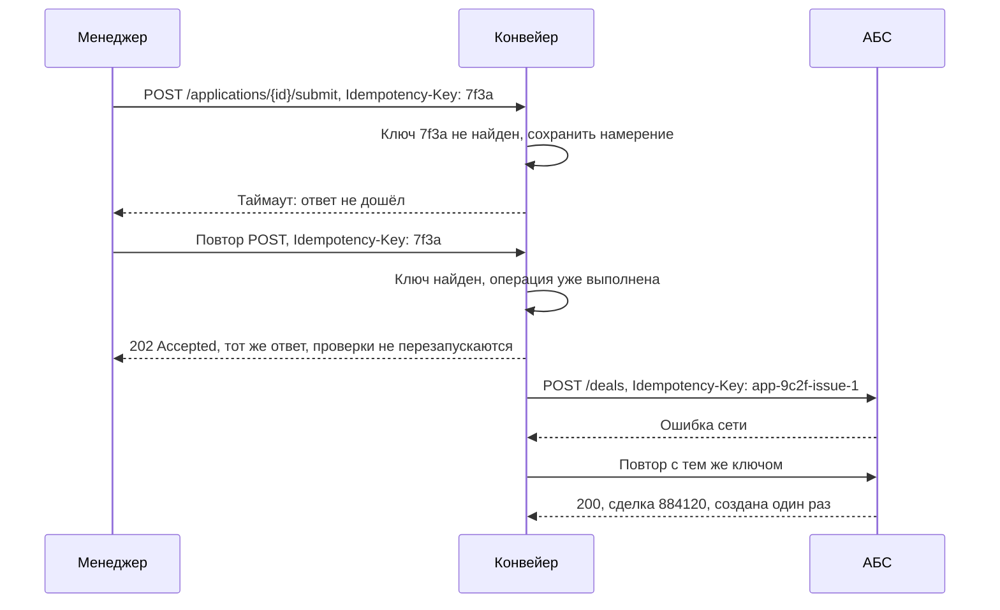

# Идемпотентность и конкурентный доступ

Два вопроса, которые аналитик обязан задать по каждой операции записи: что
произойдёт, если запрос придёт дважды, и что произойдёт, если два человека
выполнят операцию одновременно. Без ответов система работает ровно до первого
сетевого таймаута и первого совпадения по времени — то есть до первой недели
промышленной эксплуатации.

## Повтор: почему он неизбежен

Отсутствие ответа не означает отсутствие эффекта. Запрос мог дойти, операция
выполниться, а ответ потеряться на обратном пути. Клиент в этот момент не
отличает «не выполнено» от «выполнено, но я не знаю». Поэтому повторы делают
не от плохой реализации, а по необходимости — и приёмник обязан быть к ним готов.

| Свойство метода | Что означает | Пример |
| --- | --- | --- |
| Безопасный | Не меняет состояние | `GET /applications/{id}` |
| Идемпотентный по природе | Повтор даёт тот же результат | `PUT` с полным телом, удаление по идентификатору |
| Неидемпотентный | Повтор создаёт второй эффект | `POST /applications`, передача сделки в АБС |

Третья строка — вся проблема целиком. Решается ключом идемпотентности: клиент
генерирует уникальное значение и присылает его в заголовке `Idempotency-Key`;
сервер хранит пару «ключ → результат» и на повтор с тем же ключом возвращает
сохранённый ответ, не выполняя операцию заново.

Что аналитик обязан описать в требовании:

| Вопрос | Ответ для внутренней системы |
| --- | --- |
| Кто генерирует ключ | Клиент, один ключ на одно намерение пользователя |
| Сколько хранится | 24 часа — больше времени, чем длится любой разумный повтор |
| Что при совпадении ключа и совпадении тела | Возвращается сохранённый ответ, операция не повторяется |
| Что при совпадении ключа и другом теле | 409, код `duplicate_request` |
| Что при повторе после истечения хранения | Операция выполнится повторно — риск принимается осознанно |

Последняя строка важнее прочих: идемпотентность конечна во времени. Для операций
с деньгами её подпирают второй линией защиты — сверкой, о которой будет в модуле
про интеграции.

## Конкуренция: две стратегии

| Стратегия | Механизм | Когда применять | Цена |
| --- | --- | --- | --- |
| Оптимистическая | Версия объекта в `ETag`, изменение с `If-Match`; несовпадение — 412 | Короткие операции, конфликты редки | Пользователь теряет введённые данные при конфликте |
| Пессимистическая | Явная блокировка объекта за пользователем на время работы | Долгая работа человека с объектом, конфликты вероятны | Нужен срок жизни блокировки и её принудительное снятие |

У пессимистической блокировки обязательны три параметра: срок жизни, продление
при активности, право принудительного снятия. Блокировка без срока — гарантия
того, что заявка окажется заперта за сотрудником, ушедшим в отпуск.

## Где ошибаются

- **Ключ идемпотентности генерируется на каждый HTTP-вызов.** Тогда повтор
  придёт с новым ключом и защиты не будет: ключ привязывается к намерению
  пользователя, а не к попытке отправки.
- **Идемпотентность «по содержимому».** Сравнение тел запросов ломается на
  легитимных повторах: две одинаковые заявки от разных менеджеров — нормальная
  ситуация.
- **Блокировка вместо прав доступа.** Блокировка защищает от одновременного
  редактирования, но не от чтения тем, кому нельзя; это разные механизмы.
- **412 без объяснения.** Клиент должен получить не только код, но и актуальную
  версию объекта, иначе пользователь не поймёт, что изменилось.

## На конвейере

Решения по операциям «Конвейера»:

| Операция | Механизм | Параметры |
| --- | --- | --- |
| Создание заявки | `Idempotency-Key` от клиента | Ключ генерируется при открытии формы, живёт до успешного создания |
| Отправка на проверку | `Idempotency-Key` | Хранение 24 часа; повтор не перезапускает проверки в БКИ |
| Редактирование черновика | Оптимистическая, `ETag` + `If-Match` | При 412 клиент показывает, какие поля изменились |
| Принятие решения | Пессимистическая блокировка карточки | 15 минут, продление каждые 2 минуты при активности, снятие при закрытии |
| Передача сделки в АБС | `Idempotency-Key` = `app-{id}-issue-{n}` | Ключ детерминированный: повтор после перезапуска сервиса даёт тот же ключ |
| Загрузка документа | Хеш файла как ключ | Повторная загрузка того же файла не создаёт дубль |

Три детали, которые дались опытом первого пилота.

**Ключ для АБС детерминированный, а не случайный.** Случайный ключ теряется при
перезапуске сервиса, и повтор уходит в АБС как новая операция. Ключ, вычисляемый
из идентификатора заявки и номера попытки, восстанавливается после любого сбоя —
именно он защищает от двойной выдачи.

**Блокировка карточки решения — 15 минут с продлением.** Первый вариант был
без срока, и в первый же день две заявки оказались заблокированы за
андеррайтером, закрывшим браузер. Принудительное снятие доступно руководителю
андеррайтинга и пишется в журнал: это действие меняет ответственного за заявку.

**Блокировка не заменяет правило четырёх глаз.** Заблокировав карточку,
андеррайтер получает право редактировать её поля, но проверка `BRULE-9`
выполняется в момент создания решения независимо: сотрудник, участвовавший в
подготовке, получит `403 segregation_violation`, даже успешно заблокировав
заявку. Разделение этих двух проверок — не избыточность: блокировка про
одновременность, правило — про полномочия.
