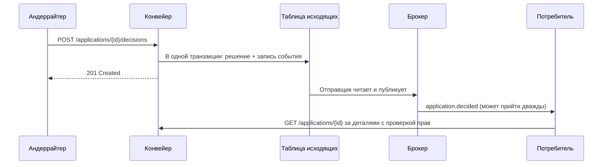

# События, очереди и то, что нельзя класть в сообщение

Очередь решает проблему доступности и создаёт четыре новых: дубликаты, порядок,
отставание и разбор неудач. Все четыре — предметные, и отвечает на них аналитик,
а не брокер сообщений.

## Гарантии доставки

| Гарантия | Что означает | Где встречается |
| --- | --- | --- |
| Не более одного раза | Сообщение может потеряться | Метрики, некритичные уведомления |
| Хотя бы один раз | Сообщение не теряется, но может прийти дважды | Практически все промышленные брокеры |
| Ровно один раз | Дубликатов нет | Только внутри ограниченных сценариев одного брокера; между системами недостижимо |

Практический вывод: проектируйте под «хотя бы один раз». Потребитель обязан быть
идемпотентным — хранить идентификаторы обработанных сообщений либо выполнять
операцию так, чтобы повтор ничего не менял.

Порядок гарантируется только внутри одного ключа партиционирования. Ключ
выбирается по объекту, для которого порядок имеет смысл: события одной заявки
должны идти по порядку, события разных заявок — не обязаны. Ключ «тип события»
или случайный ключ означает, что `decision_made` может прийти раньше
`application_submitted`, и потребитель должен уметь это пережить.

## Что кладут в событие

| Тип | Содержимое | Плюс | Минус |
| --- | --- | --- | --- |
| Уведомление | Идентификатор объекта и тип изменения | Минимум данных наружу, всегда актуальное чтение по API | Дополнительный вызов у потребителя |
| Событие с состоянием | Полный набор изменившихся полей | Потребитель не ходит за данными | Данные копируются во все системы-подписчики и устаревают |

Во внутренних системах с чувствительными данными выбор почти всегда в пользу
уведомления, и причина не техническая. Данные в сообщении оказываются в брокере,
в его дисковых журналах, в резервных копиях, в средствах мониторинга и у всех
подписчиков, включая тех, кому эти поля не положены. Проверка прав при этом не
выполняется: брокер отдаёт сообщение подписчику целиком.

Правило: в событии — идентификаторы, тип изменения, момент и версия схемы.
Персональные данные, сведения, составляющие банковскую тайну, содержимое
документов и суммы, позволяющие связать клиента с решением, в событие не
попадают. Потребитель, которому они нужны, запрашивает их по API — и там уже
работают права доступа и журнал.

## Outbox: почему без него дубликаты неизбежны

Запись в базу и отправка сообщения — две разные системы, и атомарно выполнить их
нельзя. Любой из двух порядков даёт дефект: отправили и не сохранили — событие
без причины; сохранили и не отправили — потерянное событие.

Решение: сообщение записывается в ту же транзакцию, что и изменение данных, в
таблицу исходящих; отдельный процесс читает её и отправляет в брокер, помечая
отправленное. Потеря исключена, дубликат возможен — а к дубликатам потребитель
готов по первому разделу.



## Где ошибаются

- **Схема события без версии.** Первое же изменение состава полей ломает
  потребителей, и откатить его нельзя — сообщения уже в очереди.
- **Очередь неудач без владельца.** Сообщения, которые не удалось обработать,
  копятся, пока кто-нибудь не заметит через месяц. У очереди неудач должен быть
  ответственный, срок разбора и способ повторной отправки.
- **Событие вместо запроса.** «Отправим событие и подождём, пока обработают» —
  это синхронный вызов, реализованный самым сложным способом.
- **Нет метрики отставания.** Без возраста самого старого необработанного
  сообщения вы узнаёте о проблеме от пользователей.

## На конвейере

Каталог событий «Конвейера» — восемь штук, больше не понадобилось:

| Событие | Когда | Ключ партиционирования | Потребители |
| --- | --- | --- | --- |
| `application.submitted` | Переход в `checks_running` | `application_id` | Аналитика, мониторинг SLA |
| `application.decided` | Создано решение | `application_id` | АБС-адаптер, уведомления, аналитика |
| `application.rejected` | Отказ | `application_id` | Уведомления, аналитика |
| `application.expired` | Истёк срок решения | `application_id` | АБС-адаптер (снятие резерва), уведомления |
| `deal.issued` | АБС подтвердила выдачу | `application_id` | Аналитика, архив документов |
| `stoplist.updated` | Изменён стоп-лист СБ | `entry_id` | Локальная копия стоп-листа |
| `employee.deactivated` | Сотрудник уволен | `employee_id` | Переназначение заявок, отзыв сессий |
| `consent.revoked` | Клиент отозвал согласие | `application_id` | Удаление отчёта БКИ, отмена заявки |

Пример сообщения — обратите внимание, чего в нём нет:

```json
{
  "event_id": "b1c4e0aa-9f2d-4f6e-9d0b-2c3f5e7a1b44",
  "event_type": "application.decided",
  "schema_version": 2,
  "occurred_at": "2026-09-13T11:02:41Z",
  "application_id": "9c2f0f3e-8a1d-4d52-91b7-0c2f6a1e77aa",
  "application_number": "MSB-2026-004312",
  "decision_type": "approved",
  "decided_by_role": "underwriter",
  "branch_code": "M-12"
}
```

Нет суммы, ИНН, фамилии андеррайтера и балла. Сумму получает АБС-адаптер
запросом по API — он единственный, кому она нужна, и его право на это проверяется.
Роль вместо идентификатора сотрудника — компромисс с ИБ: аналитике нужна
разбивка «автоматическое или ручное решение», а конкретный сотрудник в событии
не нужен и создавал бы в хранилище профиль производительности людей, которого
никто не заказывал.

Правила эксплуатации очередей, согласованные до разработки:

| Параметр | Значение |
| --- | --- |
| Повторные попытки обработки | 5, с задержкой 1, 5, 25, 125, 625 секунд |
| Очередь неудач | Разбирает дежурный аналитик поддержки, срок — 1 рабочий день |
| Алерт по отставанию | Возраст самого старого сообщения > 15 минут |
| Алерт по очереди неудач | Любое сообщение старше 4 часов |
| Срок хранения в брокере | 7 суток — достаточно для повторной обработки после длинных выходных |
| Изменение схемы | Только добавление необязательных полей; удаление поля — новая `schema_version` и параллельная публикация 30 дней |
