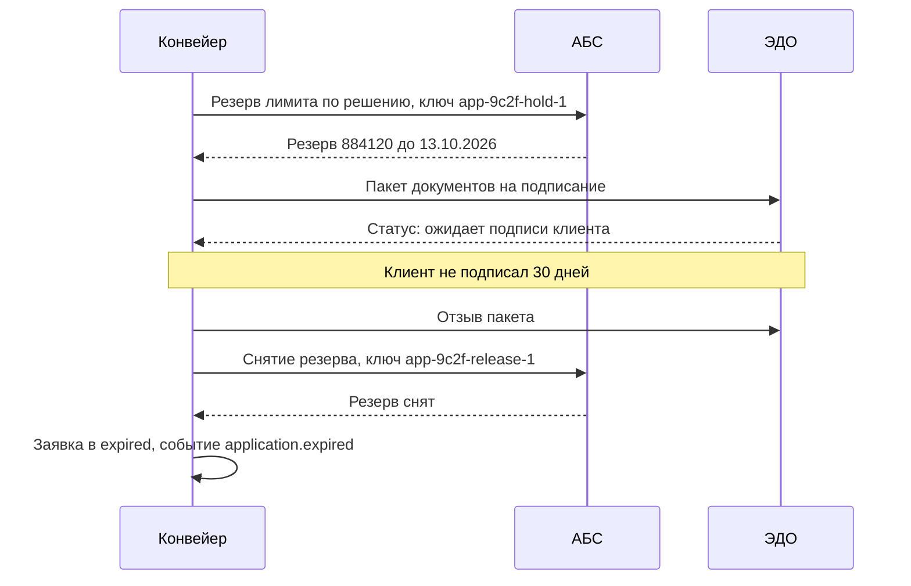

# Отказы, компенсации и сверка

Распределённой транзакции между «Конвейером», АБС и ЭДО не существует. Значит,
между шагами всегда есть момент, когда часть работы сделана, а часть нет.
Проектирование интеграции — это описание того, что происходит в этот момент.

## Бюджет времени и таймауты

Таймаут вычисляется, а не назначается «по ощущению». Правило: сумма таймаутов
вложенных вызовов плюс время собственной обработки должна быть меньше таймаута
вызывающего. Иначе внешний клиент отвалится раньше, чем вы получите ответ, и
работа будет проделана впустую.

Начинайте с человека: менеджер готов ждать отправки заявки 3 секунды. Отсюда
бюджет: проверка полноты 100 мс, ПОД/ФТ 1,5 с, ЕГРЮЛ 1 с, запас 400 мс. Всё, что
не влезает, уходит в фон.

| Механизм | Что решает | Параметры, которые задаёт аналитик |
| --- | --- | --- |
| Таймаут | Освобождает ресурс и пользователя | Значение, что показать, что записать |
| Повтор | Переживает кратковременный сбой | Число попыток, задержки, для каких кодов ошибок |
| Разброс задержки | Не даёт повторам синхронизироваться в лавину | Обязателен при массовых повторах |
| Предохранитель | Не долбит упавший сервис и не копит ожидающих | Порог ошибок, время открытия, поведение в открытом состоянии |
| Изоляция ресурсов | Отказ одной интеграции не съедает пул для остальных | Какие интеграции делят пул |

Повторять можно только то, что безопасно повторять: ошибки 5xx, таймауты,
429. Повтор на 4xx бессмысленен — данные не изменятся.

## Компенсация вместо отката

Цепочка «занять лимит → подписать → выдать» не откатывается. Каждый шаг
компенсируется отдельным действием, и компенсация — это бизнес-операция со своим
следом, а не удаление записи.

| Шаг | Компенсация | Кто инициирует |
| --- | --- | --- |
| Резерв лимита в АБС | Снятие резерва | Таймер по истечении срока решения |
| Пакет отправлен в ЭДО | Отзыв пакета | Система при отмене заявки |
| Документы подписаны | Расторжение — только операционной процедурой | Человек, автоматика запрещена |
| Сделка выдана | Компенсации нет | — |

Последняя строка — точка невозврата, и её положение определяет бизнес, а не
разработка. Правило простое: после точки невозврата любые изменения выполняются
новыми операциями с участием человека.

## Сверка

Идемпотентность защищает от дубликатов, компенсации — от незавершённых цепочек.
Сверка нужна для третьего случая: расхождения, которых по замыслу быть не может,
но которые случаются — из-за ручных операций в смежной системе, потерянных
событий, ошибок в коде.

Регламент сверки состоит из шести пунктов: что сверяем, за какой период, как
сопоставляем записи, что считается расхождением, кто разбирает, в какой срок.
Без последних двух пунктов сверка превращается в отчёт, который никто не читает.

## Где ошибаются

- **Повторы без ограничения.** Одна недоступность превращается в лавину
  запросов, и смежная система не поднимается даже после устранения причины.
- **Компенсация удалением.** Удаление записи о резерве вместо операции снятия
  ломает историю и делает расхождение необнаружимым.
- **Сверка по количеству.** Совпадение числа записей ничего не доказывает:
  расхождения бывают взаимно компенсирующими. Сверять нужно поимённо, по ключу.
- **Расхождения без владельца.** Отчёт есть, разбирать некому — через месяц в
  нём сотни строк, и его перестают открывать.

## На конвейере

Регламент ежедневной сверки с АБС:

| Пункт | Решение |
| --- | --- |
| Что сверяем | Заявки в статусах `approved` и `issued` против сделок и резервов АБС |
| Период | Предыдущие сутки плюс скользящее окно 30 дней по незакрытым |
| Ключ сопоставления | `application_id`, продублированный в АБС в поле внешнего идентификатора |
| Окно выполнения | 04:00–04:30 МСК, после ночного закрытия операционного дня |
| Что считается расхождением | Сделка в АБС без заявки; заявка `issued` без сделки; расхождение суммы или срока; резерв без действующего решения |
| Кто разбирает | Дежурный аналитик поддержки; расхождения по суммам — совместно с операционным подразделением |
| Срок разбора | 1 рабочий день; расхождение по выданной сделке — 2 часа |
| Что если расхождений больше 10 за сутки | Автоматическая приостановка передачи новых сделок, инцидент |

Типы расхождений, найденные за первые три месяца эксплуатации, и их причины:

| Расхождение | Причина | Что изменили |
| --- | --- | --- |
| Резерв в АБС без действующего решения | Заявка ушла в `expired`, снятие резерва не дошло — событие потерялось до внедрения outbox | Внедрён outbox, добавлен ежедневный автоматический возврат таких резервов |
| Сделка выдана, заявка в `approved` | Ответ АБС потерялся, «Конвейер» не узнал об успехе | Сверка переводит заявку в `issued` автоматически, если сделка найдена по `application_id` |
| Сумма сделки меньше суммы заявки | Операционист вручную скорректировал сумму при выдаче | Признано легальным случаем: сверка фиксирует, но не сигналит; расхождение отражается в отчётности |
| Две сделки по одной заявке | Повтор без идемпотентного ключа на старой версии адаптера | Детерминированный ключ, проверка в сверке оставлена как страховка |

Последняя строка объясняет, почему сверку не выключают после устранения причины:
она и есть механизм, который эту причину обнаружил. Сверка — не временная мера
на период отладки, а постоянный контроль, и относиться к её отчёту нужно как к
части процесса, а не как к артефакту тестирования.
