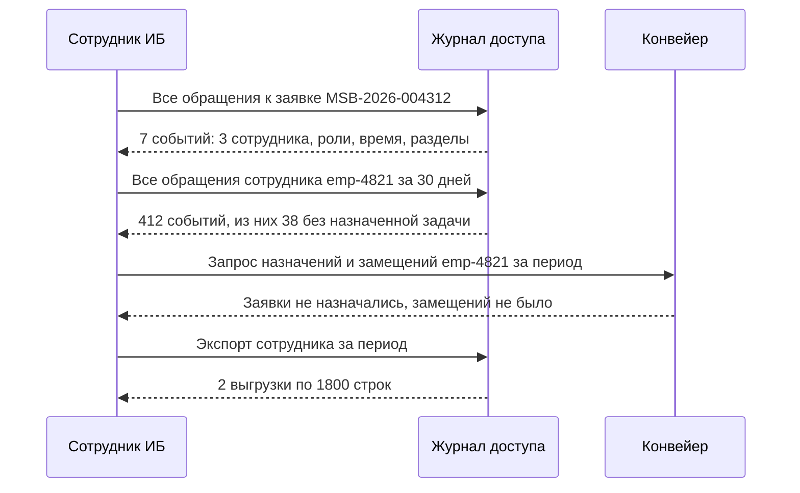

# Аудит доступа и расследования

Разграничение доступа отвечает на вопрос «кто может». Журнал доступа отвечает на
вопрос «кто воспользовался» — и без второго первое непроверяемо. Разница видна в
момент, когда ИБ спрашивает, кто из сотрудников смотрел заявки конкурента: если
журнала нет, ответа не будет ни за день, ни за месяц.

## Что журналируется

| Событие | Зачем | Частая ошибка |
| --- | --- | --- |
| Успешное чтение чувствительных данных | Основной материал расследований | Пишут только изменения, считая чтение безобидным |
| Отказ в доступе | Обнаружение попыток | Отказ не логируют, потому что «ничего не произошло» |
| Экспорт и печать | Данные покидают систему | Печать не считают событием доступа |
| Поиск по чувствительным полям | Раскрывает факт наличия клиента | Логируют результат, но не сам запрос |
| Изменение прав и ролей | Контроль полномочий | Изменение делается в IdM и не попадает в журнал системы |
| Экстренный доступ | Компенсирующий контроль | Выдают, но не проверяют использование |
| Действия под замещением | Разделение ответственности | Пишут замещающего, теряя, за кого он действовал |

Чтение — главное, что журналируют в системах с банковской тайной, и главное, что
забывают. Изменения обычно отслеживаются сами собой историей объекта; утечка же
выглядит как последовательность совершенно обычных чтений.

## Требования, которые формулирует аналитик

Журнал бесполезен, если по нему нельзя ответить на вопросы за разумное время.
Поэтому требования формулируются не «журналировать доступ», а через запросы,
которые должны выполняться:

| Вопрос | Срез | Целевое время ответа |
| --- | --- | --- |
| Что смотрел сотрудник за период | По субъекту | Минуты |
| Кто обращался к этому клиенту или заявке | По объекту | Минуты |
| Кто выгружал данные за месяц и в каком объёме | По типу операции | Минуты |
| Кто получал доступ вне области видимости | По основанию доступа | Отчёт раз в неделю |

Неизменяемость — отдельное требование: запись журнала нельзя изменить или
удалить, включая администратора системы и администратора базы данных.
Реализуется отдельным хранилищем с доступом только на добавление и чтение.

## Аномалии: что искать

Автоматические отчёты работают лучше, чем разовые проверки, но требуют порогов,
согласованных с руководителями подразделений — иначе половина сотрудников
попадёт в отчёт в первую же неделю.

| Аномалия | Признак | Почему подозрительно |
| --- | --- | --- |
| Доступ без назначенной задачи | `access_reason = branch_scope`, заявка не назначена и не создавалась субъектом | Просмотр «из любопытства» или по просьбе со стороны |
| Всплеск просмотров | Число карточек в час выше личной нормы в 3 раза | Массовый сбор данных |
| Доступ вне рабочего времени | Обращения в 02:00 | Компрометация учётной записи или подготовка к уходу |
| Просмотр связанных с собой лиц | Совпадение по фамилии или известным связям | Конфликт интересов |
| Массовый экспорт перед увольнением | Экспорт в последние две недели работы | Вынос клиентской базы |

## Где ошибаются

- **Журнал в той же базе с теми же правами.** Администратор системы может
  подчистить следы — и тогда журнал не доказательство.
- **Логи приложения вместо журнала доступа.** Технические логи содержат лишнее,
  живут недолго и не рассчитаны на поиск по субъекту.
- **Отчёт без владельца.** Аномалии находят, но никто не обязан их разбирать.
- **Персональные данные в журнале.** Разобрано в модуле про данные: журнал
  фиксирует факт доступа, а не содержимое.

## На конвейере

Три отчёта, согласованные с ИБ до разработки:

| Отчёт | Периодичность | Порог | Получатель | Действие |
| --- | --- | --- | --- | --- |
| Доступ без назначенной задачи | Еженедельно | Более 20 карточек за неделю | Руководитель отделения | Объяснение по каждому случаю в течение 3 дней |
| Использование экстренного доступа | При каждом включении | Любое | Руководитель ИБ | Сверка с номером служебного расследования |
| Экспорт данных | Ежемесячно | Более 5 выгрузок или более 2000 строк за месяц | ИБ и руководитель подразделения | Проверка обоснованности |

Сценарий расследования — как он проходит на практике:

Важная деталь этого сценария: последний шаг обращается к журналу, а не к
«Конвейеру». Сама система не знает, что находилось в выгруженном файле — знает
только журнал, где записаны фильтры и число строк. Поэтому состав фильтров
выгрузки — обязательное поле журнала, без него расследование упирается в
«выгрузил что-то».

Требование `NFR-7` из второго модуля — «поддержка диагностирует инцидент по
номеру заявки без доступа к персональным данным» — реализовано так:

| Средство | Что содержит | Кто видит |
| --- | --- | --- |
| Сквозной идентификатор запроса `request_id` | Проставляется на входе, передаётся во все вызовы | Поддержка |
| Технический лог | `request_id`, `application_id`, коды ошибок, длительности | Поддержка |
| Журнал событий заявки | Переходы статусов, роли, время | Поддержка и пользователи |
| Журнал доступа | Факты обращений | Только ИБ и аудит |
| Значения полей заявки | — | Только по ролям в самой системе |

Поддержка, получив обращение «заявка MSB-2026-004312 зависла», видит цепочку
вызовов, таймаут БКИ и код ошибки — и не видит ни фамилии, ни телефона, ни
суммы. За первый год эксплуатации это не помешало закрыть ни одного обращения:
для диагностики нужны идентификаторы и коды, а не значения.
