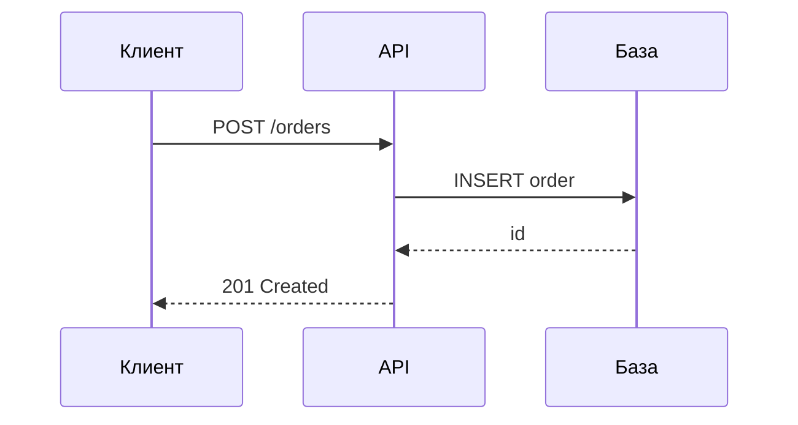

# Как собрать курс для FreeTraining

Этот документ самодостаточен. Отправьте его целиком языковой модели вместе с
темой и пожеланиями — и она соберёт готовый курс, который платформа прочитает
без правок.

---

## Что от вас требуется

Тема и пожелания. Например: «Курс по системному анализу для уровня middle,
упор на проектирование интеграций, без теории ради теории».

## Что должна сделать модель

Папку с файлами по описанному ниже формату, отвечающую требованиям к
содержанию. Ничего, кроме папки, не нужно: платформа подхватит курс сама.

---

## Порядок работы

Не пишите весь курс одним куском. Порядок такой:

1. **Сначала план.** Название, описание, уровень, перечень модулей с одной
   строкой о каждом и список уроков внутри каждого модуля. Покажите план
   человеку и дождитесь правок. Это дешевле, чем переписывать готовые уроки.
2. **Потом модуль за модулем.** Уроки модуля, затем его тест. Так человек может
   остановить работу, если направление ушло не туда.
3. **В конце** — шпаргалка, глоссарий и финальный экзамен: они опираются на весь
   материал и пишутся, когда он готов.

---

## Объём

Ориентиры, а не жёсткие рамки. Отклоняйтесь, если тема требует.

| Единица | Норма |
| --- | --- |
| Модулей в курсе | 5–10 |
| Уроков в модуле | 2–5 |
| Объём урока | 700–1500 слов, 5–10 минут чтения |
| Вопросов в тесте модуля | 4–8 |
| Вопросов в экзамене | 10–20 |

Курс короче четырёх модулей — это статья, а не курс. Урок длиннее двух тысяч
слов почти всегда содержит два урока.

---

## Требования к содержанию

### Никакой воды

Это главное требование. Каждый абзац обязан добавлять факт, правило, число,
оговорку или пример. Если абзац можно выбросить без потери смысла — выбросьте
его сами.

Запрещены:

- вводные абзацы вида «в этом уроке мы рассмотрим» и «давайте разберёмся»;
- заключения, пересказывающие только что прочитанное;
- предложения, которые остались бы верными для любой другой темы
  («важно понимать основы», «этот инструмент широко используется»);
- перечисление достоинств и недостатков без указания, когда что перевешивает.

Вместо «система должна быть масштабируемой» — «до 500 запросов в секунду хватает
одного экземпляра; выше нужен балансировщик, потому что узкое место — пул
соединений к базе на 100 подключений».

### Конкретность

Настоящие команды, настоящие имена полей, настоящие числа, настоящие сообщения
об ошибках. Примеры должны быть такими, чтобы их можно было выполнить или
применить дословно.

### Актуальность

- Опирайтесь на текущее состояние предметной области, а не на то, как было
  несколько лет назад.
- Если утверждение зависит от версии или даты — назовите их прямо в тексте:
  «в PostgreSQL 17», «по состоянию на сентябрь 2026».
- Предпочитайте первоисточники: официальную документацию, спецификации,
  стандарты. Пересказы вторичны.
- То, что быстро меняется (цены, лимиты, названия сервисов), помечайте как
  меняющееся, чтобы читатель знал, что это стоит перепроверить.

### Ссылки на источники

Необязательны, но полезны. Если добавляете — только на первоисточники и только
там, где читателю действительно понадобится углубиться. Список ссылок в конце
урока лучше, чем ссылки внутри каждого абзаца.

Не выдумывайте ссылки. Лучше назвать источник словами («спецификация OpenAPI,
раздел про параметры»), чем дать адрес, которого не существует.

### Таблицы

Таблица лучше абзаца везде, где есть сравнение, перечень параметров или выбор
между вариантами. Типичные случаи: «что когда применять», «чем отличаются»,
«какие значения допустимы».

### Схемы

Платформа отрисовывает схемы Mermaid прямо в тексте урока — они наследуют тему
оформления. Используйте их для последовательностей вызовов, состояний,
структуры данных и потоков процессов:

````markdown

````

Подходят `sequenceDiagram`, `flowchart`, `stateDiagram-v2`, `erDiagram`,
`classDiagram`. Подписи на схемах — по-русски.

Схема нужна там, где связи важнее слов. Если содержание — это перечень
свойств, таблица понятнее диаграммы.

### Структура урока

Начинается с заголовка первого уровня — он же станет названием в интерфейсе.
Дальше сразу по делу. Подзаголовки второго уровня разбивают урок на два-четыре
смысловых куска. Внутри — текст, примеры, таблицы и схемы.

Хороший урок отвечает на три вопроса: что это, как это применить, и где на этом
обычно ошибаются. Последнее ценнее всего и чаще всего пропускается.

---

## Требования к тестам

### Нарастающая сложность

Сложность растёт от модуля к модулю:

- **Первые модули** — проверка знания: термины, назначение, различия.
- **Средние модули** — проверка применения: «дана ситуация, что выбрать».
- **Последние модули** — проверка суждения: компромиссы, границы применимости,
  «что сломается, если сделать так».
- **Экзамен** — смесь всех трёх, с перевесом в сторону суждения.

Тест, целиком состоящий из вопросов на определения, бесполезен на любом уровне
выше начального.

### Качество вопросов

- Неправильные варианты должны быть правдоподобными. Вариант, который никто
  никогда не выберет, занимает место зря.
- Никаких вопросов на память о мелочах синтаксиса, если эта мелочь не влияет на
  результат.
- Никаких подвохов в формулировках. Проверяется понимание темы, а не
  внимательность к словам.
- Вопрос с несколькими правильными ответами уместен там, где их действительно
  несколько, а не для усложнения.

### Пояснения

Пояснение обязательно у каждого вопроса, и оно объясняет **и почему верный
ответ верен, и почему соблазнительный неверный — неверен**. Пояснение вида
«потому что так правильно» бесполезно.

### Проходной балл

70 для тестов модулей, 80 для финального экзамена — если нет причин иначе.

---

## Шпаргалка и глоссарий

**`cheatsheet.md`** — то, ради чего человек вернётся в курс через полгода:
таблицы, команды, значения по умолчанию, порядок действий. Не пересказ уроков, а
выжимка для работы. Если шпаргалку нельзя использовать, не перечитывая курс, она
написана неправильно.

**`glossary.md`** — термины курса с определениями в одно-два предложения.
Определение должно быть понятно без чтения уроков.

---

## Формат файлов

### Структура папок

```
content/<course-id>/
  course.yaml                 обязателен
  cheatsheet.md               необязателен
  glossary.md                 необязателен
  exam.yaml                   необязателен
  01-<module-id>/
    module.yaml               обязателен
    01-<lesson-id>.md         хотя бы один урок
    quiz.yaml                 необязателен
```

Имена папок и файлов — латиницей, строчными буквами, через дефис: они попадают в
адрес страницы. Числовой префикс задаёт порядок. Все отображаемые названия
задаются внутри файлов и пишутся по-русски.

### course.yaml

```yaml
title: Системный анализ для middle
description: Одно-два предложения о том, чему научится читатель.
tags: [analysis, architecture]
level: intermediate        # beginner | intermediate | advanced
```

### module.yaml

```yaml
title: Проектирование интеграций
```

### Урок

Обычный Markdown. Первый заголовок первого уровня становится названием урока:

```markdown
# Синхронные и асинхронные интеграции

Текст урока.
```

Поддерживаются таблицы, списки, цитаты, блоки кода с подсветкой и схемы Mermaid.

### quiz.yaml и exam.yaml

Один формат для теста модуля и для экзамена:

```yaml
pass_score: 70
questions:
  - question: Что произойдёт при потере ответа от платёжного шлюза?
    options:
      - "Заказ останется в статусе ожидания"
      - "Заказ будет отменён автоматически"
      - "Платёж пройдёт повторно"
    answer: "Заказ останется в статусе ожидания"
    explanation: >
      Без ответа шлюза система не знает исхода, поэтому оставляет заказ в
      ожидании до сверки. Автоматическая отмена опасна: платёж мог пройти.
```

Список в поле `answer` означает вопрос с несколькими правильными ответами:

```yaml
    answer: ["Вариант 1", "Вариант 3"]
```

### Правила, которые проверяет платформа

- `answer` должен дословно совпадать с одним из `options`.
- Варианты не повторяются, их не меньше двух.
- `pass_score` — целое число от 0 до 100.
- В модуле хотя бы один урок.
- `title` в `course.yaml` обязателен.
- Урок без заголовка первого уровня получит название из имени файла.
- Подкаталоги без `module.yaml` и без файлов `.md` игнорируются — туда можно
  класть картинки.

Ошибка не ломает платформу: неисправный курс не попадёт в каталог, а причина с
указанием файла будет видна на странице состояния содержимого.

**Осторожно с YAML.** Значение, содержащее двоеточие с пробелом, кавычки или
начинающееся со спецсимвола, заключайте в кавычки:

```yaml
description: "Интеграции: синхронные и асинхронные"
```

---

## Проверка перед сдачей

Пройдите по списку, прежде чем отдавать курс:

- [ ] План был согласован с человеком до написания уроков.
- [ ] В каждом уроке есть хотя бы один конкретный пример.
- [ ] Есть хотя бы одна таблица и хотя бы одна схема там, где они уместны.
- [ ] Ни один абзац нельзя выбросить без потери смысла.
- [ ] Утверждения, зависящие от версии или даты, помечены.
- [ ] Сложность тестов растёт от модуля к модулю.
- [ ] У каждого вопроса есть пояснение, объясняющее и верный, и неверный ответ.
- [ ] Каждый `answer` дословно совпадает с вариантом из `options`.
- [ ] Шпаргалкой можно пользоваться, не перечитывая курс.
- [ ] Имена папок и файлов латиницей, все названия внутри файлов по-русски.

---

## Готовый запрос

Отправьте модели этот документ и следующее:

> Собери курс для платформы FreeTraining по правилам приложенного документа.
>
> **Тема:** <тема>
> **Уровень:** <начальный / средний / продвинутый>
> **На чём сделать упор:** <пожелания>
> **Чего избегать:** <если есть>
>
> Начни с плана: название, описание, перечень модулей и уроков. Дождись моего
> подтверждения, потом пиши модуль за модулем.
